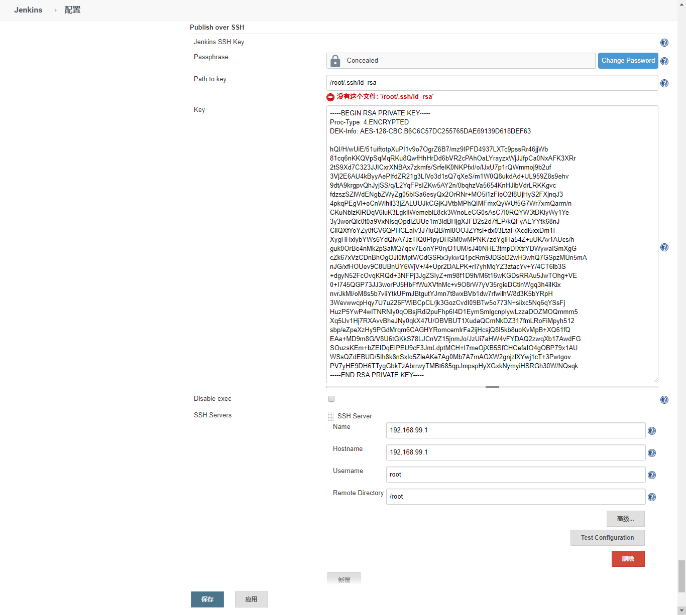
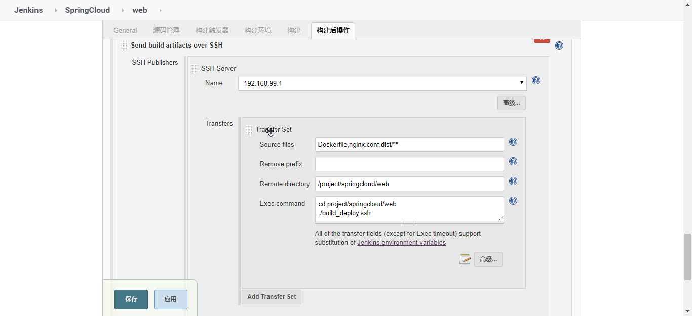

## Publish Over SSH

#### 配置
<font size="2">

1. 生成密钥(用户.ssh目录生成 id_rsa, id_rsa.pub)
```
cd ~
ssh-keygen -t rsa
cd .ssh/
```

2. 将 id_rsa.pub 复制到远程服务/root/.ssh/下并重命名authorized_keys

3. Jenkins 系统管理 > 系统配置 > Publish over SSH

Passphrase： 密码
Path to key: 密钥地址(/root/.ssh/id_rsa)
Key: 密钥(/root/.ssh/id_rsa文件内容，此选项优先Path to key)
SSH Servers > Name: 远程服务名(192.168.99.1)
SSH Servers > Hostname: 远程服务地址(192.168.99.1)
SSH Servers > Username: 远程服务用户名(root)
SSH Servers > Remote Directory: 远程服务保存根路径(/root)

4. Jenkins 项目配置 > 构建后操作

Transfer Set > Source files: 需要复制的文件(Dockerfile,nginx.conf,dist/**)
Transfer Set > Remove prefix: 去除前缀
Transfer Set > Remote directory: 远程服务路径(/project/springcloud/web) # 最终路径为步骤3(SSH Servers > Remote Directory)+步骤4(Transfer Set > Remote directory)
Transfer Set > Exec command: 在远程服务执行shell
例如执行docker打包部署脚本 deploy.ssh
```
#!/usr/bin/env bash

# 构建Docker镜像并运行
DOCKERHOST="192.168.99.101"
IMAGENAME="vue-ant-demo"
CONTAINERNAME="vue-ant-demo"

# 构建镜像
docker -H $DOCKERHOST:2376 --tlsverify build --no-cache -t $IMAGENAME .
if [ "$?"-ne 0]; then echo "command failed"; exit 1; fi

# 获取容器ID并输出
CONTAINERID=sudo tail ../CONTAINERID -n 1
echo $CONTAINERID
# 停止容器并删除
docker -H $DOCKERHOST:2376 --tlsverify stop $CONTAINERNAME
docker -H $DOCKERHOST:2376 --tlsverify rm $CONTAINERNAME
if [ "$?"-ne 0]; then echo "command failed"; exit 1; fi

# -p 配置端口映射，格式是外部访问端口：容器内端口
# -d 后台运行
# --name 给容器取名
# 最后有2个vue-ant-demo,前面一个是给容器取的名字，后面一个是使用的镜像的名字
docker -H $DOCKERHOST:2376 --tlsverify run -p 80:80 -d --name $CONTAINERNAME $IMAGENAME >> ../CONTAINERID
# 删除所有<none>的镜像
docker -H $DOCKERHOST:2376 --tlsverify rmi `docker -H $DOCKERHOST:2376 --tlsverify images | grep "<none>" | awk '{print $3}'`

# 判断上条命令是否执行成功，当执行失败的时候显示错误信息，并停止向下执行
if [ "$?"-ne 0]; then echo "command failed"; exit 1; fi
```

</font>