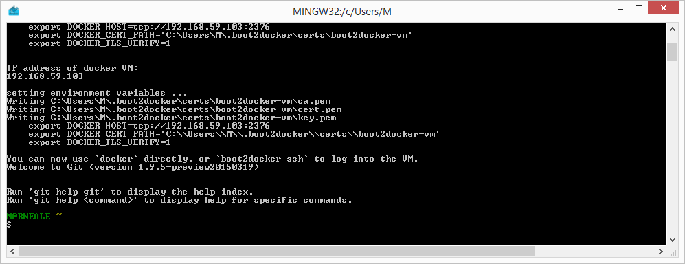

## [Windows 上安装 Docker Toolbox](https://docs.docker.com/toolbox/toolbox_install_windows/)
> <font size="2">旧版桌面解决方案。 Docker Toolbox适用于不符合Mac的Docker桌面和Windows的Docker桌面的要求的旧Mac和Windows系统。 如果可能，我们建议更新到较新的应用程序。</font>
<font size="2">Docker Toolbox提供了一种在不满足Docker Desktop for Windows应用最低系统要求的Windows系统上使用Docker的方法。</font>

#### 内容及工作原理
<font size="2">

Docker Toolbox包含以下Docker工具：
* Docker CLI客户端，用于运行Docker Engine创建映像和容器
* Docker Machine，因此您可以从Windows终端运行Docker Engine命令
* Docker Compose，用于运行docker-compose命令
* Kitematic，Docker GUI
* 为Docker命令行环境预先配置的Docker QuickStart shell
* Oracle VM VirtualBox

由于Docker Engine守护程序使用特定于Linux的内核功能，因此您无法在Windows上本地运行Docker Engine。 相反，您必须使用Docker Machine命令docker-machine在计算机上创建并附加到小型Linux VM。 该VM在Windows系统上为您托管Docker Engine。

> 提示：较新的[Docker Desktop for Windows](https://docs.docker.com/docker-for-windows/)决方案的优点之一是它使用本机虚拟化，不需要VirtualBox运行Docker。

</font>

#### 步骤1：检查您的版本
<font size="2">

要运行Docker，您的计算机必须具有运行Windows 7或更高版本的64位操作系统。 此外，您必须确保在计算机上启用了虚拟化。 要验证您的计算机满足这些要求，请执行以下操作：

1. 右键单击Windows消息，然后选择“系统”。
如果您使用的不是受支持的版本，则可以考虑升级操作系统。
如果您拥有较新的系统，尤其是带有Enterprise and Education（1607周年更新，Build 14393或更高版本）的64位Windows 10 Pro，请考虑使用Docker Desktop for Windows。 它在Windows上本地运行，因此不需要预先配置的Docker QuickStart shell。 它还使用Hyper-V进行虚拟化，因此以下检查虚拟化的说明对于较新的Windows系统而言已过时。 Windows的Docker桌面主题中提供了完整安装的先决条件，在安装前应了解的知识。
2. 确保您的Windows系统支持硬件虚拟化技术，并且已启用虚拟化。
对于Windows 10
运行[Speccy](https://www.ccleaner.com/speccy)，然后查看CPU信息。
3. 确认您的Windows操作系统是64位（x64）
验证方式取决于Windows版本。
有关详细信息，请参阅Windows文章[如何确定计算机运行的是Windows操作系统的32位版本还是64位版本](https://support.microsoft.com/en-us/kb/827218)。

</font>

#### 步骤2：安装DockerToolbox
<font size="2">

在本节中，您将安装Docker Toolbox软件和一些“帮助程序”应用程序。 安装会将以下软件添加到您的计算机：
* Windows版Docker客户端
* Docker工具箱管理工具和ISO
* Oracle VM VirtualBox
* Git MSYS-git UNIX工具

如果您安装了以前版本的VirtualBox，请不要使用Docker Toolbox安装程序重新安装它。 出现提示时，请取消选中它。

如果您正在运行Virtual Box，则必须在运行安装程序之前将其关闭。
> 注意：Docker不再维护Docker Toolbox的download.docker.com URL，因此在安装过程中会显示未签名的警告（已验证的发布者对话框）。

1. 要下载最新版本的Docker Toolbox，请转到Toolbox Releases并下载最新的.exe文件。
2. 通过双击安装程序来安装Docker Toolbox。
安装程序将启动“设置-Docker工具箱”对话框。
如果Windows安全对话框提示您允许程序进行更改，请选择“是”。 系统显示Setup-Windows的Docker Toolbox向导。
3. 按下一步接受所有默认设置，然后按安装。
接受所有安装程序的默认设置。 安装程序需要几分钟来安装所有组件：
4. 当Windows安全性通知您时，安装程序将进行更改，请确保您允许安装程序进行必要的更改。
完成后，安装程序将报告成功。
5. 取消选中“在文件资源管理器中查看快捷方式”，然后按完成。

</font>

#### 步骤3：验证安装
<font size="2">

安装程序将Docker Toolbox，VirtualBox和Kitematic添加到您的Applications文件夹中。 在此步骤中，您将启动Docker Toolbox并运行一个简单的Docker命令。

1. 在桌面上，找到Docker QuickStart Terminal图标。

2. 单击Docker QuickStart图标，以启动预配置的Docker Toolbox终端。
如果系统显示“用户帐户控制”提示，以允许VirtualBox对您的计算机进行更改。 选择是。
终端会执行几项操作来为您设置Docker Toolbox。 完成后，终端显示$提示符。

终端运行特殊的bash环境，而不是标准Windows命令提示符。 bash环境是Docker所必需的。
3. 通过单击$提示符旁边的鼠标，使终端处于活动状态。
如果您不熟悉终端窗口，请参考以下快速提示。
提示通常是美元符号。 您在命令行中，即提示符后的区域中键入命令。 光标由突出显示的区域或|指示。 出现在命令行中。 键入命令后，请始终按RETURN。
4. 输入docker run hello-world命令，然后按RETURN。
该命令为您完成了一些工作，如果一切正常，则命令的输出如下所示：
    ```
    $ docker run hello-world
    Unable to find image 'hello-world:latest' locally
    Pulling repository hello-world
    91c95931e552: Download complete
    a8219747be10: Download complete
    Status: Downloaded newer image for hello-world:latest
    Hello from Docker.
    This message shows that your installation appears to be working correctly.

    To generate this message, Docker took the following steps:
      1. The Docker Engine CLI client contacted the Docker Engine daemon.
      2. The Docker Engine daemon pulled the "hello-world" image from the Docker Hub.
        (Assuming it was not already locally available.)
      3. The Docker Engine daemon created a new container from that image which runs the
        executable that produces the output you are currently reading.
      4. The Docker Engine daemon streamed that output to the Docker Engine CLI client, which sent it
        to your terminal.

    To try something more ambitious, you can run an Ubuntu container with:
      $ docker run -it ubuntu bash

    For more examples and ideas, visit:
      https://docs.docker.com/userguide/
    ```

</font>

#### 如何卸载工具箱
<font size="2">
删除工具箱涉及删除其包含的所有Docker组件。

完全卸载还包括删除您使用Docker Machine创建的本地和远程计算机。 在某些情况下，您可能希望保留使用Docker Machine创建的计算机。

例如，如果您计划将Docker Machine作为Windows Docker Desktop的一部分重新安装，则可以继续通过Docker管理这些计算机。 或者，如果您在云提供程序上有远程计算机，并计划使用该提供程序来管理它们，则不希望删除它们。 因此，此处将删除计算机的步骤描述为可选步骤。

要在Windows上卸载Toolbox，请执行以下操作：
1. 列出您的机器。
```
$ docker-machine ls
NAME                ACTIVE   DRIVER       STATE     URL                        SWARM
dev                 *        virtualbox   Running   tcp://192.168.99.100:2376
my-docker-machine            virtualbox   Stopped
default                      virtualbox   Stopped
```

2. （可选）卸下每台计算机。 例如：
```
$ docker-machine rm my-docker-machine
Successfully removed my-docker-machine
```
此步骤是可选的，因为如果您打算作为Docker Desktop for Windows的一部分重新安装Docker Machine，则可以通过Docker导入并继续管理这些计算机。

3. 使用Window的标准过程来卸载Docker Toolbox，该过程可通过控制面板卸载程序（程序和功能）。
> 注意：此过程不会删除docker-install.exe文件。 您必须自己删除该文件。

4. （可选）删除`C:\Users\<your-user>\.docker`目录。
如果要完全删除Docker，则可以验证卸载是否删除了用户路径下的.docker目录。 如果仍然存在，请手动将其删除。 该目录存储一些Docker程序的配置和状态，例如有关创建的机器和证书的信息。 您通常不需要删除此目录。

5. 卸载作为工具箱安装的一部分安装的Oracle VirtualBox。

</font>