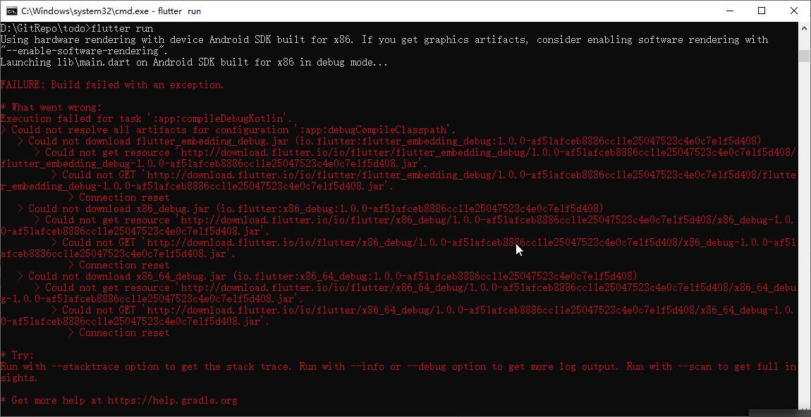

## Flutter

* 官网：https://flutter.dev/
* 中文网：https://flutter.cn/


#### 问题
1. flutter run 报错（2020.4.26）
```
Flutter 1.12.13+hotfix.9 • channel stable • https://github.com/flutter/flutter.git
Framework • revision f139b11009 (4 weeks ago) • 2020-03-30 13:57:30 -0700
Engine • revision af51afceb8
Tools • Dart 2.7.2
```

解决方案：
修改D:\flutter\packages\flutter_tools\gradle目录文件
1.aar_init_script.gradle
2.flutter.gradle
3.resolve_dependencies.gradle
http://download.flutter.io -> https://storage.googleapis.com/download.flutter.io
```
1. aar_init_script.gradle
...
project.repositories {
  maven {
    //url "https://download.flutter.io"
    url "https://storage.googleapis.com/download.flutter.io"
  }
}
...
2. flutter.gradle
...
class FlutterPlugin implements Plugin<Project> {
  //private static final String MAVEN_REPO = "http://download.flutter.io";
  private static final String MAVEN_REPO = "https://storage.googleapis.com/download.flutter.io";
...
3. resolve_dependencies.gradle
repositories {
  google()
  jcenter()
  maven {
    //url "https://download.flutter.io"
    url "https://storage.googleapis.com/download.flutter.io"
  }
}
```
